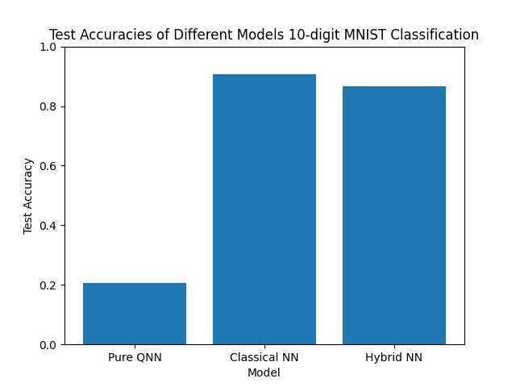
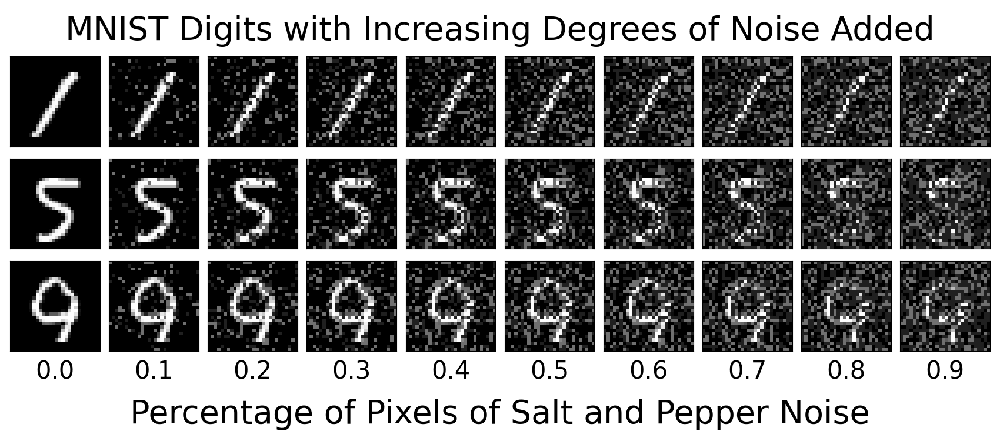

## Setup conda environment
(if necessary) `module load anaconda`

`conda env create -f environment.yaml`

### Alternative setup
If the conda installation is taking too much time/memory, use manual setup:

```
conda create -n qmnist python=3.9
conda activate qmnist
conda install pip
pip install -r requirements.txt
```


## Run code

`conda activate qmnist`

`python mnist.py`

### mnist.py command line arguments:
- --epochs: **(int)** num. epochs to train for, default is 2
- --noise: **(float)** std. deviation of noise added to images, default 0 which means no noise
- --model_name: **(string)** the name of the model to run, default is "QNN":
    - "ClassicalNN" is also supported

## Generate visuals

The utils folder contains files to visualize the results. Here is an example generated plot based on our results:



Here is a noise chart generated by util/overlay.py:

